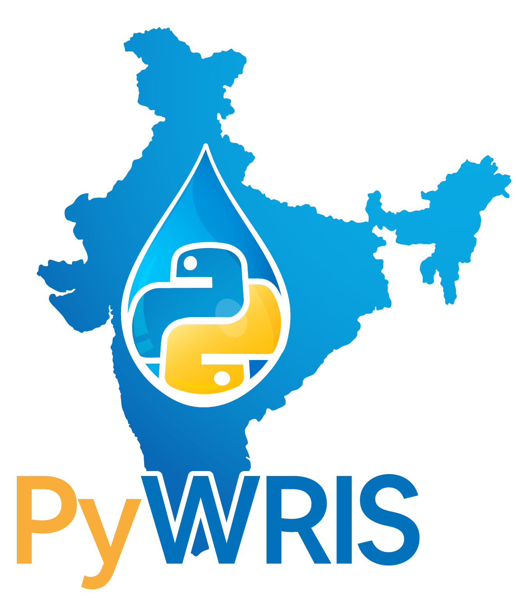

**_A Python package for accessing India Water Resource and Information System (IndiaWRIS) data_**

[India WRIS](https://indiawris.gov.in/wris/#/) is a rich collection of nation-wide water resource data provided by the Ministry of Water Resource, Government of India. It provides valuable information on various aspects of water resources, including data on river basins, dams, reservoirs, groundwater levels, water quality, and meteorological data. However, accessing this data can be challenging due to the platform's web-based, graphic-heavy front-end. Downloading bulk data for research purposes through this front-end framework is often time consuming and problematic due to slow load times.

**PyWRIS** enables programatic querying, downloading and interaction with the India WRIS data via a python package, making it easier for researchers, students, and water resource professionals to access and use this data in their workflows.

## Key Features

- **Flexible Queries**: Perform queries to filter data by specific geographic regions, time periods, or water resource categories.
- **Automated Data Retrieval**: PyWRIS uses Web Scraping to seamlessly gather large volumes of data without navigating the web-based portal manually through a streamlined Python interface.
- **Data Processing**: Parse and structure the downloaded data into useful formats through integration with popular data processing libraries such as pandas, geopandas and xarray.
- **Data Interaction**:
  - Creation of interactive and static plots for data visualization
  - Compute key statistical measure for robust quantitative analysis
  - Compare datasets across different geographic entities, water resource types, or temporal ranges to identify trends and patterns.

## Installation

Follow these steps to install **PyWRIS** and get started:

#### 1. Clone the Repository

Clone this GitHub repository to get the latest codebase:

```bash
git clone https://github.com/username/PyWRIS.git
cd PyWRIS
```

#### 2. Install using Conda

```bash
conda install pywris -c conda-forge
```

## Usage

## Contributing

Contributions are highly welcome! If you encounter issues or have suggestions, please feel free to open an issue. Contributions should follow the guidelines specified in Contributing.md.

1. Clone/Fork the repository.
2. Create a new branch.
3. Submit a pull request for review.

All contributions are encouraged to help make PyWRIS more robust and versatile for the hydrology and water resource research communities.

## License

**PyWRIS** is released under the MIT License.

You are free to use, copy, modify, merge, publish, distribute, sublicense, and/or sell copies of this software, provided that the original copyright notice and this permission notice are included in all copies or substantial portions of the software.

See the full text in [LICENSE](./LICENSE) for more details.

**Disclaimer**: The India WRIS data accessed by this package is provided and owned by the Ministry of Water Resources, Government of India. PyWRIS is an independent project and is not affiliated with or endorsed by the Ministry of Water Resources, Government of India. Please ensure compliance with the terms of use for any data accessed through the India WRIS platform.


## Team Member
Shahzaib
